# Лабораторная работа № 1
```
Тема:		"Фаззинг тестирование"
Группа:		ИУ8-93
Студент:	Митрофанов Д.А.
```
---
## Цель
Изучить принципы фаззинг тестирование с использованиен инструмента AFL++.
## Задание
1. Выбрать цель для тестирования с открытым исходным кодом, написанную на языке C/C++;
2. Собрать AFL++;
3. Собрать цель тестирования с использованием компиляторов AFL++;
4. Осуществить фаззинг тестирование;
5. Составить отчёт по результатам работы.
## Ход работы
### 1 Выбор цели
В качестве цели тестирования был выбран инструмент armake. Этот инструмент используется разработчиками для создания дополнительного контента в игре Arma 3. Данный инструмент позволяет:
* binarize - преобразовать файл в представление, подходящее для быстрой загрузки игровым движком (.bin);
* derapify - преобразовать любой двоичный файл в обычный текст;
* build - создавать архивы .pbo, интерпретируемы игрой;
* inspect - проверять сборку .pbo;
* unpack - распаковаывать архивы .pbo;
* cat - проверять наличие файла в .pbo;
* keygen - создавать ключи для подписи;
* sign - подписывать ключами .pbo;
* img2paa - преобразовывать изображения в изоброажения с расшширением .paa, воспринимаемые игрой;
* paa2img - преобразовывать .paa обратно в изображения.

Данный инструмент имеет открытый исходный код и его можно найти на [github](https://github.com/KoffeinFlummi/armake).
### 2 Сборка AFL++
Собираем AFL++ согласно [инструкции](/tools/AFLplusplus/docs/INSTALL.md).
```sh
sudo apt-get update
sudo apt-get install -y build-essential python3-dev automake cmake git flex bison libglib2.0-dev libpixman-1-dev python3-setuptools cargo libgtk-3-dev
sudo apt-get install -y lld-12 llvm-12 llvm-12-dev clang-12
sudo apt-get install -y gcc-$(gcc --version|head -n1|sed 's/\..*//'|sed 's/.* //')-plugin-dev libstdc++-$

pushd .
cd tools/AFLplusplus
make source-only
sudo make install
popd
```
### 3 Сборка цели тестирования
Для сборки armake в директорию `armake/src` был добавлен файл `argv-fuzz-inl.h`.
В файл `main.c` были внесены изменения, представленные ниже:
```sh
				исходный файл	изменённый файл
			       	   | 		    |
diff tools/armake/src/main.c tools/main.c 
36a37
> #include "argv-fuzz-inl.h"
218a220
>       AFL_INIT_ARGV();
```
> Изменения в файл `main.c` были добавлены после прочтения [статьи](https://milek7.pl/howlongsudofuzz/), в которой говорится, что AFL не поддерживает argv фаззинг. Но речь в той статье шла о сталом AFL, поэтому на момент написания я задумываюсь о необходимости данных изменений в рамках фаззинга с AFL++.

В файле `armake/Makefile` был изменён только компилятор:
```sh
			исходный файл	изменённый файл
			       | 			  |
diff tools/armake/Makefile tools/Makefile 
11c11
< CC = gcc
---
> CC = afl-gcc
```
Сборка утилиты armake:
```sh
pushd .
cd tools/armake
make
popd
```
### 4 Фаззинг тестирование
Фаззинг тестирование проводилось в 4 потоках в течение 6 часов. Оно могло производится и дольше, если бы память на устройстве не начала заканчиваться: с утра размер виртуальной машины занимал 250 Gb из-за большого числа сгенерированных файлов и папок. После безуспешной попытки освободить свободное место было принято решение дождаться того момента, чтобы каждый поток проработал чуть больше 6 часов и остановить тестирование.

По результатам тестирования были получены следующие данные:
```
afl-whatsup -d output/
/usr/bin/afl-whatsup status check tool for afl-fuzz by Michal Zalewski

Individual fuzzers
==================

>>> ./src/armake (0 days, 6 hrs) fuzzer PID: 25719 <<<

  Instance is dead or running remotely, skipping.

  last_find       : none seen yet
  last_crash      : 4 days, 0 hours
  last_hang       : 3 days, 23 hours
  cycles_wo_finds : not available
  cpu usage %, memory usage %
  cycles 104, lifetime speed 278 execs/sec, items 406/661 (61%)
  pending 0/1, coverage 4.70%, crashes saved 56 (!)

>>> ./src/armake (0 days, 6 hrs) fuzzer PID: 1783 <<<

  Instance is dead or running remotely, skipping.

  last_find       : none seen yet
  last_crash      : 4 days, 0 hours
  last_hang       : 3 days, 23 hours
  cycles_wo_finds : 0
  cpu usage %, memory usage %
  cycles 21, lifetime speed 354 execs/sec, items 43/509 (8%)
  pending 0/94, coverage 4.86%, crashes saved 85 (!)

>>> ./src/armake (0 days, 6 hrs) fuzzer PID: 7681 <<<

  Instance is dead or running remotely, skipping.

  last_find       : none seen yet
  last_crash      : 4 days, 0 hours
  last_hang       : 4 days, 0 hours
  cycles_wo_finds : 0
  cpu usage %, memory usage %
  cycles 26, lifetime speed 317 execs/sec, items 48/530 (9%)
  pending 0/2, coverage 4.90%, crashes saved 78 (!)

>>> ./src/armake (0 days, 6 hrs) fuzzer PID: 14733 <<<

  Instance is dead or running remotely, skipping.

  last_find       : none seen yet
  last_crash      : 3 days, 23 hours
  last_hang       : 3 days, 23 hours
  cycles_wo_finds : 0
  cpu usage %, memory usage %
  cycles 26, lifetime speed 299 execs/sec, items 181/523 (34%)
  pending 0/9, coverage 4.87%, crashes saved 78 (!)

Summary stats
=============

       Fuzzers alive : 0
      Dead or remote : 4 (included in stats)
      Total run time : 1 days, 0 hours
         Total execs : 27 millions
    Cumulative speed : 1248 execs/sec
       Pending items : 0 faves, 106 total
       Crashes saved : 297
Cycles without finds : 1/0/0/0
  Time without finds : 0
```
Все данные работы фаззинга хранятся в [output.tar.gz](output.tar.gz).
### 4.1 Первый поток
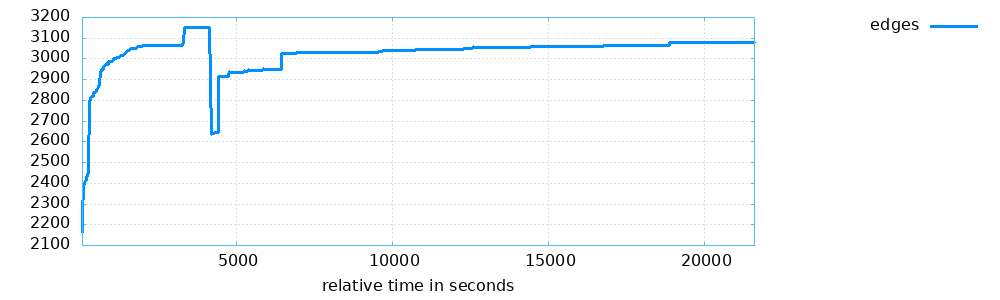
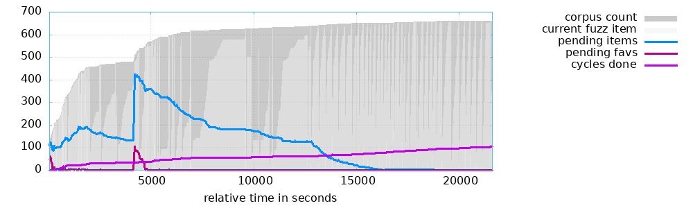
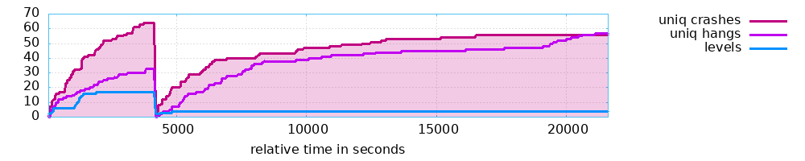
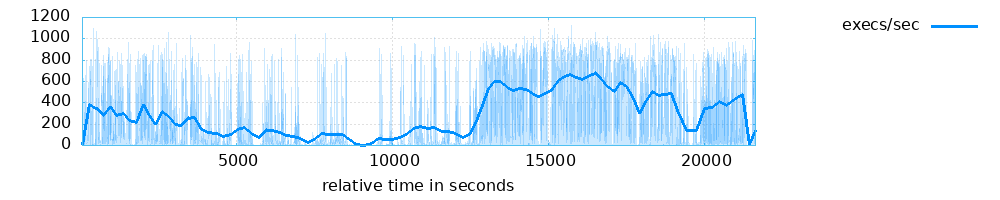
> В начале был момент, когда окно случаайно закрылось и первый поток завершился, его отчётливо можно видеть на графике.
### 4.2 Второй поток
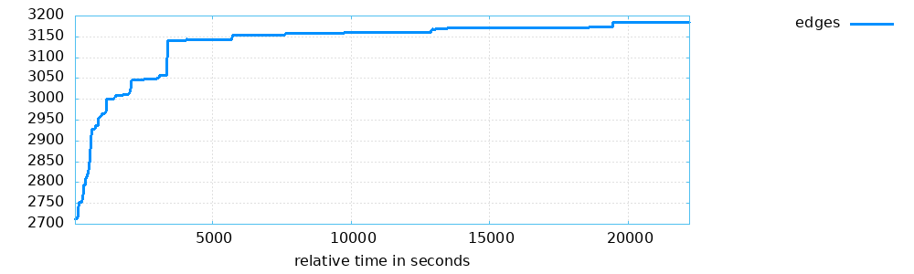
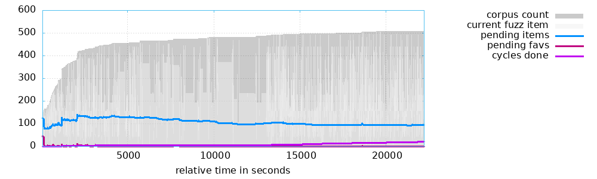

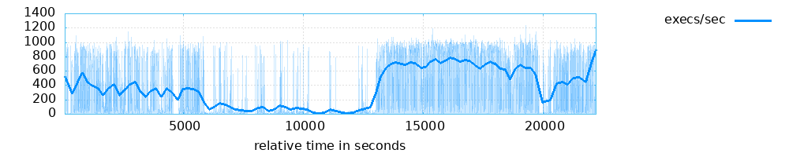
### 4.3 Третий поток
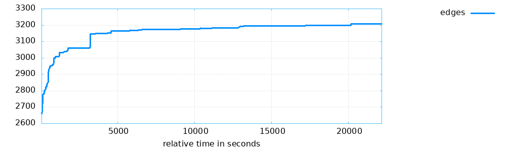
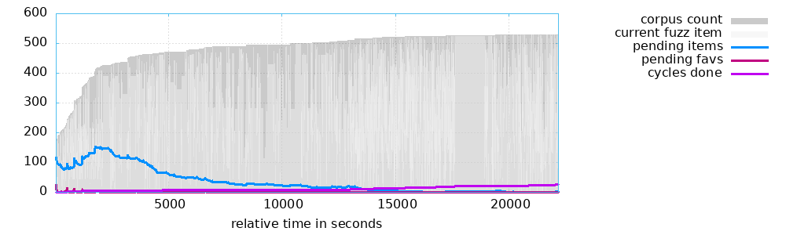
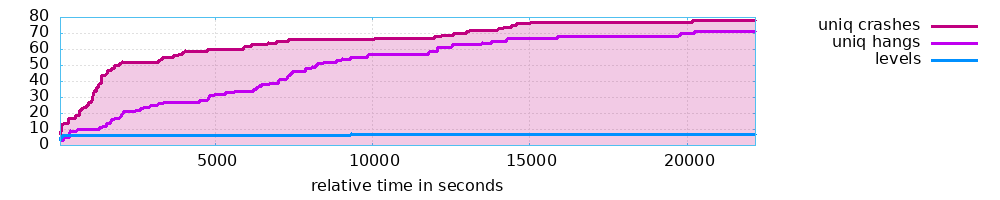
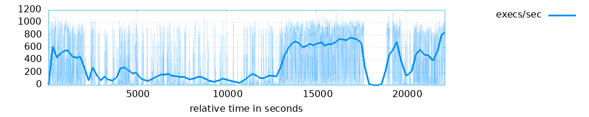
### 4.4 Четвёртый поток
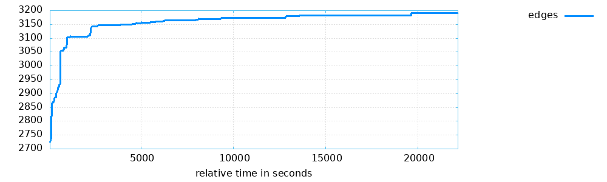
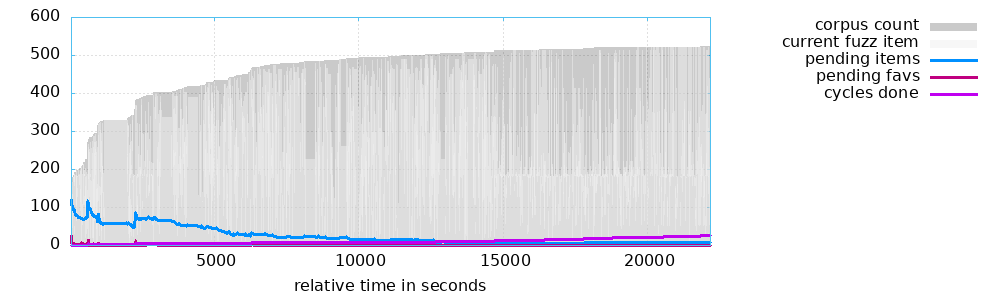
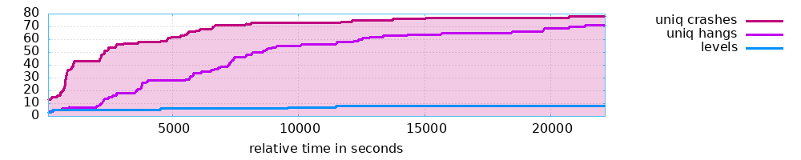

## Вывод
В ходе выполнения работы был собран инструмент фаззинг-тестирования AFL++. С помощью AFL++ была скомпилирована цель тестирования, после чего бы проведён её фаззинг с использованием вручную написанных данных.